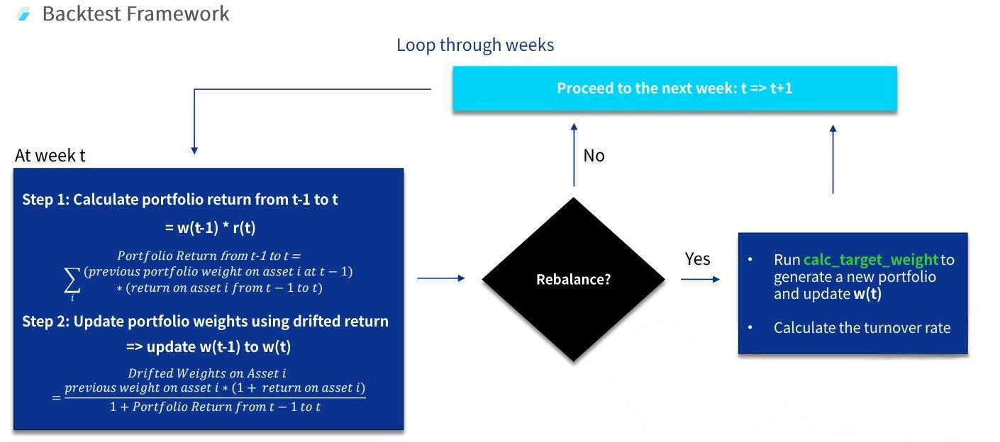

# Portfolio-Management
In this project,  we build a backtesting framework for robust portfolio optimization with eight asset classes, including equities, fixed income, real estate and commodities. 

## Backtesting
#### Strategy Pipeline

#### Backtest Framework 

