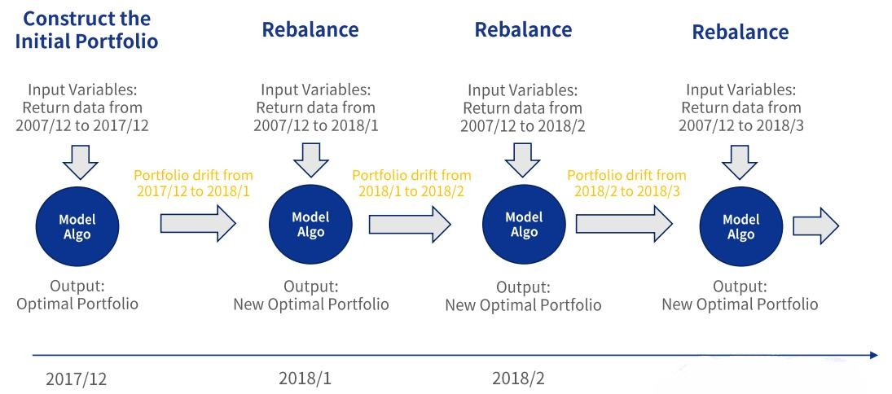
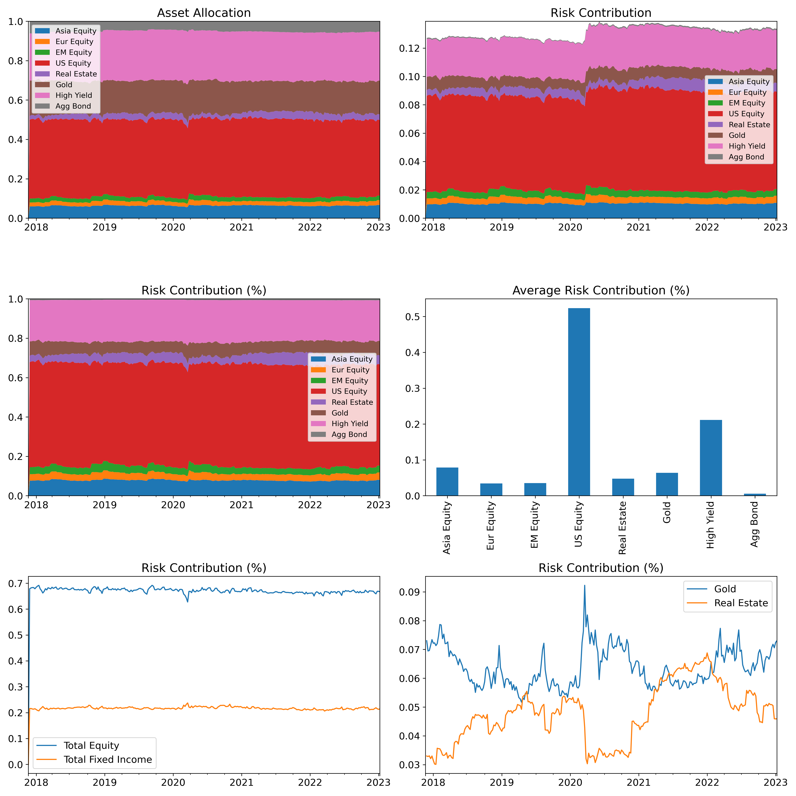
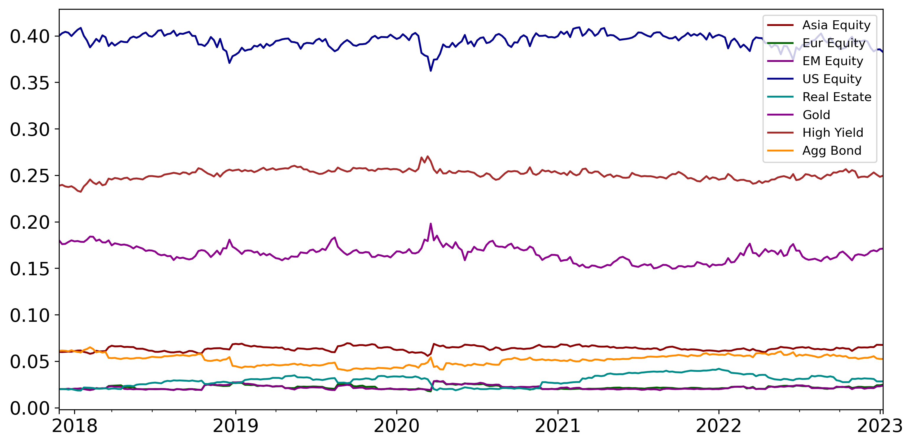
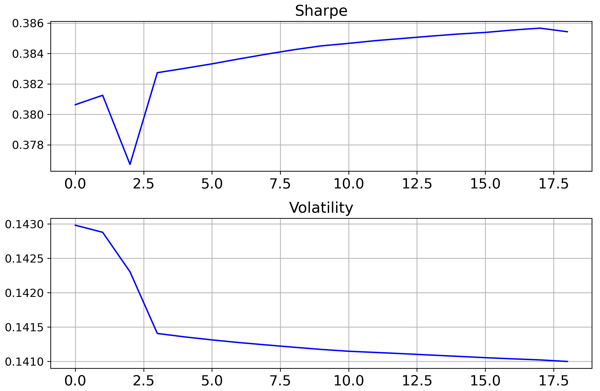
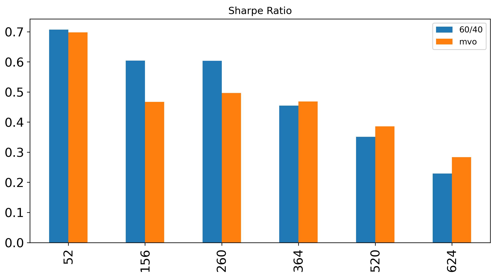

# Portfolio-Management
In this project we build a backtesting framework for robust portfolio optimization models for multi-asset classes, including equities, fixed-income, real estate, and commodities. 

### Target

Construct a dynamically rebalanced robust portfolio with multi-asset classes.

### Data

Daily prices of four asset classes from 1990-2023 of equities (US equity, EM equity, Asia equity, Europe equity), fixed-income (high yield bond, aggregate bond), real estate (US real estate) and commodity (gold).

### Strategy Pipeline

## Backtest

#### Risk Contribution

#### Optimal Portfolio Weights

#### Robustness Check

Check the model robustness for different asset classes, different hyper-parameter values (risk control and turnover control), different backtest windows.

- Change of Sharpe and volatility with different risk penalty parameter $\lambda$

- Performance comparison for different backtest windows

### Models

$$\text{argmax}_w(\mu^{T}w-\cfrac{1}{2}\lambda w^T\Sigma w- \gamma \left|| w - \hat{w} \right||^2)$$

- $\sum_i w_i = 1, w_i>0$ are portfolio weights, $\hat{w}$ is the previous weight

- $\mu$: mean asset returns
- $\Sigma$: covariance matrix, portfolio volatility
- $\lambda$: risk penalty parameter (higher $\lambda$ means lower volatility)
- $\gamma$: portfolio turnover penalty parameter (higher $\gamma$ means lower turnover)

#### Performance Summary

| Models | Return | Volatility | Sharpe | Max Drawdown | Turnovers |
| ------ | :----: | :--------: | :----: | :----------: | :-------: |
| V1     | 0.0200 |   0.0714   | 0.2799 |   -0.1691    |  0.2518   |
| V1.5   | 0.0163 |   0.0738   | 0.2216 |   -0.1778    |  0.3581   |
| V2     | 0.0475 |   0.1183   | 0.4021 |   -0.2044    |  0.2468   |
| V3     | 0.0479 |   0.1211   | 0.3957 |   -0.2110    |  0.1499   |
| V4     | 0.0542 |   0.1411   | 0.3845 |   -0.2383    |  0.1828   |

- v1: Markowitz model
- V1.5: mean-variance + winsorization
- V2: mean-variance+ winsorization + notional control 
- V3: mean-variance+ winsorization + notional control + turnover control 
- V4 (Final model): mean-variance+ winsorization + notional control + turnover control + risk control

